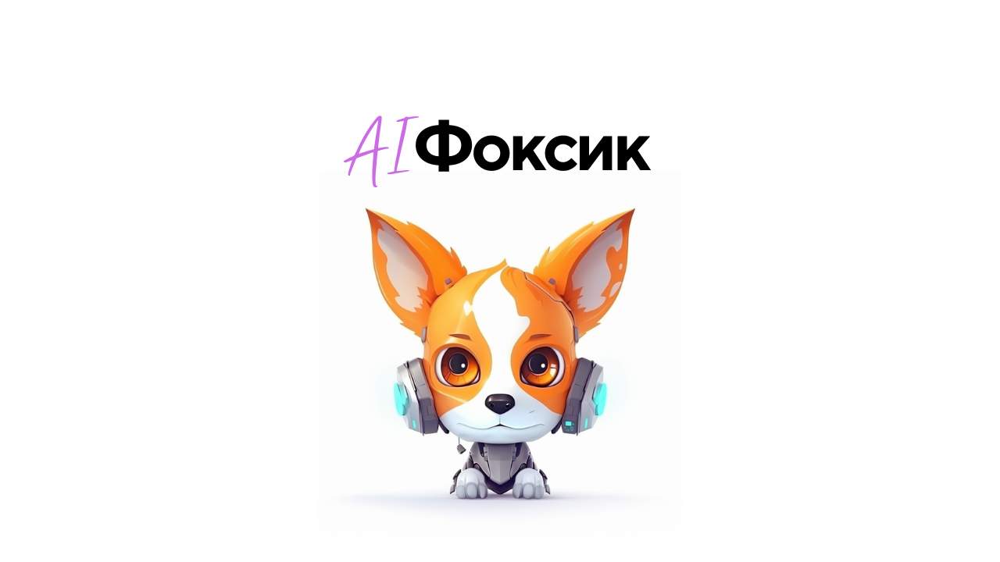

# AI Фоксик - цифровой ассистент сотрудника МФЦ

Решение по [кейсу](docs/mfc.pdf) МФЦ от команды **НейроДрайв** на хакатоне Цифровой прорыв сезон ИИ

## Решение

## Демо

[Демонстрационная версия](https://hacks-ai.ycdev.ru)

## Архитектура

Решение состоит из 4 сервисов и плагина для CMS Joomla 3.0

1. **Сервис обработки запросов от пользователей**
   [api-service](https://github.com/airndlab/hackathon-hacks-ai-2023-api-service)
2. **Сервис ранжировщик с использованием модели**
   [ranker-service](https://github.com/airndlab/hackathon-hacks-ai-2023-ranker-service)
3. **Сервис подготовки ответа с помощью модели**
   [squad-service](https://github.com/airndlab/hackathon-hacks-ai-2023-squad-service)
4. **Сервис ранжировщик**
   [vanilla-ranker-service](https://github.com/airndlab/hackathon-hacks-ai-2023-vanilla-ranker-service)
5. **Плагин для CMS Joomla** [joomla-plugin](https://github.com/airndlab/hackathon-hacks-ai-2023-joomla-plugin)

## Подготовка

Дляиспользования плагина предварительно необходимо установить CMS Joomla. 

[Инструкция по установка CMS Joomla с использованием docker ](docs/joomla.md)

## Запуск

Перед запуском необходимо настроить переменные окружения в файле `.env`

Запустить сервисы: `docker compose up -d`