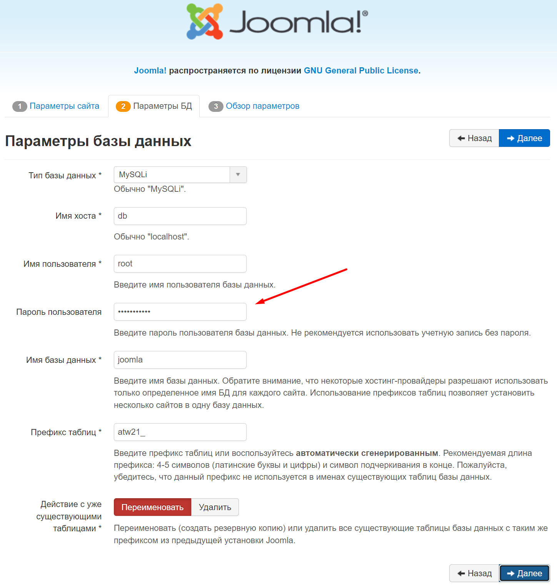

# hackathon-hacks-ai-2023

Решение по кейсу МФЦ от команды **НейроДрайв** на хакатоне Цифровой прорыв сезон ИИ

# Решение

Цифровой ассистент для сотрудника МФЦ

## Архитектура

Решение состоит из 3 сервисов и плагина для CMS Joomla

1. **Сервис обработки запросов от пользователей**
   [api-service](https://github.com/airndlab/hackathon-hacks-ai-2023-api-service)
2. **Сервис ранжировщик**
   [ranker-service](https://github.com/airndlab/hackathon-hacks-ai-2023-ranker-service)
3. **Сервис подготовки ответа с помощью модели**
   [squad-service](https://github.com/airndlab/hackathon-hacks-ai-2023-squad-service)

- **Плагин для CMS Joomla** [joomla-plugin](https://github.com/airndlab/hackathon-hacks-ai-2023-joomla-plugin)

## Joomla CMS

### Запуск в docker

Запускаем Joomla: `docker compose -f joomla.docker-compose.yml up -d`

Переходим на [localhost:80](http://localhost:80):

1. Создаем учетную запись `admin/admin`
   
2. Подключаемся к MySQL базе данных с паролем `joomla_pass`
   
3. Устанавливаем
   
4. Удаляем директорию и переходим в панель управления под `admin/admin`
   

### Установка нашего плагина

В панели управления:

1. Идем в установки расширений
   
2. Устанавливаем наш плагин по ссылке
   
3. Плагин успешно установлен
   
4. Включаем наш плагин
   
5. Плагин включен
   
