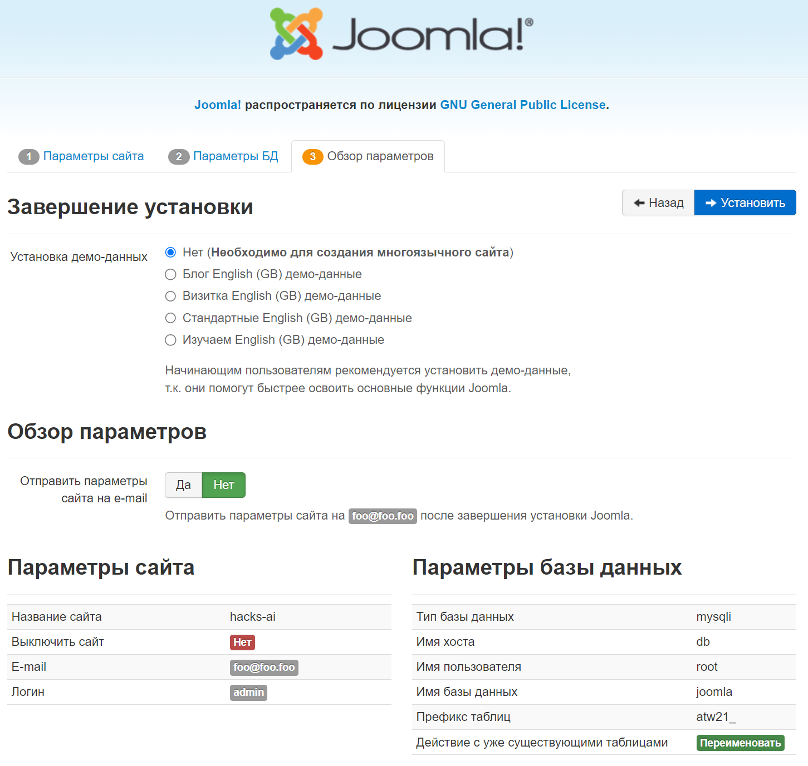
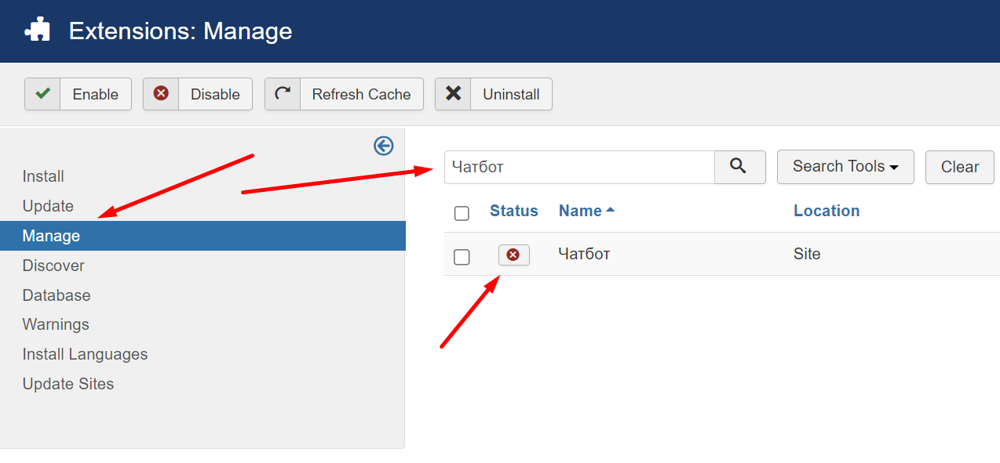
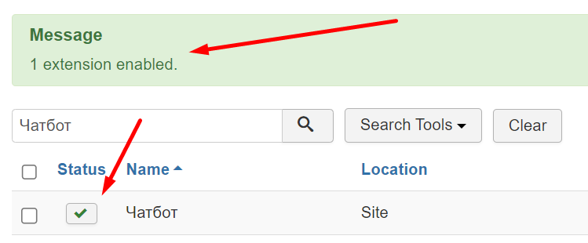

## Joomla CMS

### Запуск в docker

Запускаем Joomla: `docker compose -f joomla.docker-compose.yml up -d`

Переходим на [localhost:80](http://localhost:80):

1. Создаем учетную запись `admin/admin`

   
2. Подключаемся к MySQL базе данных с паролем `joomla_pass`

   
3. Устанавливаем

   
4. Удаляем директорию и переходим в панель управления под `admin/admin`

   

### Установка нашего плагина

В панели управления:

1. Идем в установки расширений

   
2. Устанавливаем наш плагин по ссылке

   
3. Плагин успешно установлен

   
4. Включаем наш плагин

   
5. Плагин включен

   
